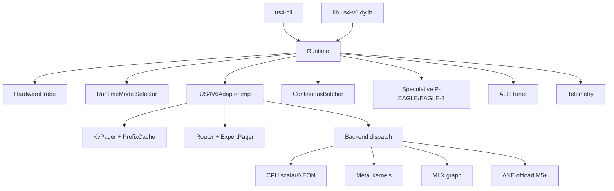

# Domain — US4 V6 Apple Edition

## Glossario
- **Adapter** — modulo que adapta um family de modelos LLM (Qwen, Llama, DeepSeek MoE, etc.) a interface comum `IUS4V6Adapter`.
- **Backend** — pilha de execucao computacional: CPU scalar, NEON, MLX, Metal, ANE.
- **Runtime Mode** — perfil global de execucao baseado em recursos disponiveis: FULL / BALANCED / DEGRADED / ULTRA_LOW / MICRO / MICRO_PLUS.
- **KV Cache** — armazenamento de tensores key/value de attention para evitar recomputacao.
- **Hot-Cold KV Tiering** — KV pages em camadas: hot (unified memory), warm (RAM), cold (SSD), summary (compressed).
- **MoE (Mixture of Experts)** — arquitetura com N experts e router que escolhe top-k experts por token.
- **Expert Pager** — gerencia carregamento on-demand de experts MoE em unified memory.
- **SP-MoE** — Speculative MoE prefetch: prediz proximos experts e carrega em paralelo.
- **Speculative Decoding** — gera tokens com draft model pequeno, verifica com target model.
- **P-EAGLE / EAGLE-3** — algoritmos de speculative decoding tree-verify.
- **ANE** — Apple Neural Engine, accelerator dedicado (M-series).
- **MLX** — Apple ML framework com unified memory + graph eval.
- **Correctness Diff** — diferenca numerica vs reference impl (HF/PyTorch); gate de qualidade.

## Entidades
- `IUS4V6Adapter` — interface base de todos adapters.
- `RuntimeMode` — enum de perfis.
- `HardwareProbe` — descobre chip, RAM, MLX, ANE caps.
- `BackendSelector` — escolhe backend por mode + adapter capability.
- `KvPager` / `PrefixCache` / `Summarizer` — subsistema KV.
- `Router` / `ExpertPager` / `SpeculativePrefetch` — subsistema MoE.
- `ContinuousBatcher` / `SessionPool` — scheduling multi-sessao.
- `AutoTuner` / `Profile` — tuning hardware-aware.
- `Telemetry` — metricas (latencia, tokens/s, RAM peak, hit-rate, mode transitions).

## Diagrama

## Invariantes
- Toda chamada `IUS4V6Adapter::generate()` produz tokens determinsticamente para `(seed, temperature=0)`.
- KV evictado pro SSD restaura identico ao mantido em hot.
- Speculative decoding produz tokens **identicos** ao path non-speculative.
- Mode transitions sao monotonicas dentro de uma sessao (so degrada, nunca volta sem reset).
- Backend selecionado nunca pode quebrar correctness diff alem da tolerancia configurada.

## Estados de runtime
- `idle` — sem sessao ativa.
- `loading` — adapter sendo carregado.
- `ready` — pronto pra gerar.
- `generating` — em decode (single ou batched).
- `degraded` — mode rebaixado por pressao de RAM/thermal.
- `error` — falha irrecuperavel (OOM, kernel crash) -> reset.

## Termos vetados
- "MoE expert offload" sem qualificar tier (use "offload to RAM" / "offload to SSD").
- "Auto" sem qualificar o que e auto (mode? backend? tile size?).
- "Fast" sem numero (use ">=X tokens/s em chip Y").
