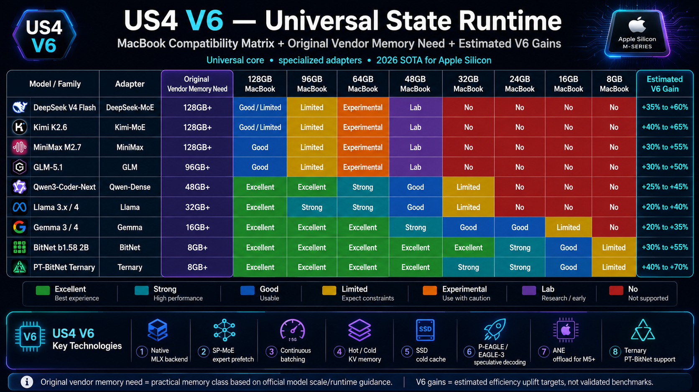

# US4 V6 - Apple Edition

> Universal State Runtime for local LLM inference on Apple Silicon.
> EN. Versao pt-BR: [README.pt-BR.md](README.pt-BR.md).




## Run Locally

This is the shortest path to clone, build, run, and validate the project on a local machine.


### 1. Clone

```bash
git clone https://github.com/wesleysimplicio/us4-v6-simplicio-apple.git
cd us4-v6-simplicio-apple
```

### 2. Install Tooling

Minimum tools:

- Node.js 16.7 or newer
- npm
- CMake 3.27 or newer
- Ninja
- a C++20 compiler

Recommended on macOS:

```bash
xcode-select --install
brew install cmake ninja node
npm ci
npx playwright install
```

Recommended on Windows:

```powershell
npm ci
npx playwright install
```

On Windows, run native CMake commands from a Visual Studio Developer shell when available.

### 3. Configure And Build

macOS/Linux:

```bash
cmake -S . -B build -G Ninja -DCMAKE_BUILD_TYPE=Release
cmake --build build --config Release
```

Windows PowerShell:

```powershell
cmake -S . -B build -G Ninja -DCMAKE_BUILD_TYPE=Release
cmake --build build --config Release
```

If Ninja is not available, CMake may use your platform default generator. Keep the same `build` directory.

### 4. Run The CLI

macOS/Linux:

```bash
./build/apps/us4-cli --probe
./build/apps/us4-cli run --model qwen-0.5b --prompt "hi" --max-tokens 8
./build/apps/us4-cli run --model qwen-0.5b --prompt "hi" --max-tokens 8 --json
```

Windows PowerShell:

```powershell
.\build\apps\us4-cli.exe --probe
.\build\apps\us4-cli.exe run --model qwen-0.5b --prompt "hi" --max-tokens 8
.\build\apps\us4-cli.exe run --model qwen-0.5b --prompt "hi" --max-tokens 8 --json
```

Useful model fixture examples:

```bash
./build/apps/us4-cli run --model-path tests/fixtures/models/qwen-0.5b/model.us4manifest --prompt "hi" --json
./build/apps/us4-cli run --model-path tests/fixtures/models/llama-3.1-8b --prompt "hello" --json
./build/apps/us4-cli run --model-path tests/fixtures/models/bitnet-b1.58-2b/model.us4manifest --backend neon --prompt "tiny" --json
```

### 5. Validate Everything


Run the fast JavaScript gates:

```bash
npm run lint
npm test -- --coverage
npm run pack:dry
```

Run native build and regression:

```bash
cmake --build build --config Release
ctest --test-dir build --output-on-failure -C Release
```

Run CLI E2E evidence:

```bash
npx playwright test --reporter=list,html tests/e2e/us4-cli.spec.ts
```

Run benchmark evidence:

macOS/Linux:

```bash
./build/runtime/benchmarks/dense_baseline
./build/runtime/benchmarks/matrix_runner
```

Windows PowerShell:

```powershell
.\build\runtime\benchmarks\dense_baseline.exe
.\build\runtime\benchmarks\matrix_runner.exe
```

### 6. Serve OpenAI-Compatible Endpoint (Local LLM, Ollama-Compatible)

US4 V6 ships an OpenAI-shape HTTP endpoint that drop-in replaces Ollama for
any client expecting `/v1/chat/completions`, `/v1/completions`, `/v1/models`,
or `/v1/embeddings`. Chat is served by `mlx_lm.server` (managed child
process); embeddings are served in-process by `mlx-embeddings`. Single-file
Python sidecar at `scripts/openai_serve.py`. No FastAPI, no uvicorn.

Two ways to run it: the **Python sidecar directly** (no C++ build required —
fastest path, recommended for local LLM use) or the **C++ CLI wrapper**
(`us4-cli serve`, identical contract once the native build exists).

#### 6.1 Python sidecar (recommended — no C++ build)

One-time setup. Use a project venv to avoid `externally-managed-environment`
on Homebrew Python:

```bash
python3 -m venv .venv
.venv/bin/pip install -r scripts/requirements-serve.txt
```

Run with defaults (chat + embeddings, bind `127.0.0.1:8080`, child mlx-lm on
`8081`). Always invoke the venv interpreter explicitly — `python3` from the
system PATH will not see MLX:

```bash
.venv/bin/python scripts/openai_serve.py
```

The server reads configuration from environment variables (no CLI flags):

| Env var | Default | Meaning |
|---|---|---|
| `US4_SERVE_HOST` | `127.0.0.1` | bind address |
| `US4_SERVE_PORT` | `8080` | public port (mlx-lm child uses `PORT + 1`) |
| `US4_SERVE_CHAT_BACKEND` | `mlx` | chat upstream selector — `mlx`, `ollama`, or custom |
| `US4_SERVE_CHAT_UPSTREAM` | unset | override upstream base URL (e.g. `http://127.0.0.1:11434`) |
| `US4_SERVE_CHAT_MODEL` | `mlx-community/Qwen2.5-Coder-7B-Instruct-4bit` (or `qwen2.5-coder:14b` when backend=ollama) | chat model id |
| `US4_SERVE_EMBED_MODEL` | `mlx-community/embeddinggemma-300m-bf16` | embedding model id |
| `US4_SERVE_DISABLE_CHAT` | unset | set `1` to disable chat backend |
| `US4_SERVE_DISABLE_EMBED` | unset | set `1` to disable embeddings backend |
| `US4_SERVE_LOG_LEVEL` | `INFO` | `DEBUG` / `INFO` / `WARNING` / `ERROR` |

Example: pick a smaller 3B chat model on a memory-constrained M1 8 GB:

```bash
US4_SERVE_CHAT_MODEL=mlx-community/Qwen2.5-Coder-3B-Instruct-4bit \
US4_SERVE_PORT=8080 \
.venv/bin/python scripts/openai_serve.py
```

First start downloads model weights from HuggingFace into
`~/.cache/huggingface/` (7B 4-bit MLX ≈ 4 GB, 3B 4-bit ≈ 1.7 GB). Subsequent
starts reuse the cache.

Example: front an already-running Ollama daemon (chat goes through Ollama,
embeddings stay MLX-local). Useful when you want to reuse models already
pulled into Ollama without re-downloading the MLX variant from HuggingFace:

```bash
# 1) make sure Ollama is up and the model is pulled
ollama serve &                        # or launch the Ollama.app
ollama pull qwen2.5-coder:7b

# 2) point us4-v6 at the Ollama daemon as its chat upstream
US4_SERVE_CHAT_BACKEND=ollama \
US4_SERVE_CHAT_MODEL=qwen2.5-coder:7b \
.venv/bin/python scripts/openai_serve.py
```

Wire diagram in this mode:

```text
client ─► 127.0.0.1:8080 (us4-v6 OpenAI shape)
              ├─► /v1/chat/completions  ──► 127.0.0.1:11434 (Ollama)
              └─► /v1/embeddings         ──► in-process mlx-embeddings
```

This mode is what you want when:

- you already use Ollama for model management (`ollama pull`, `ollama list`,
  `ollama rm`) and only need the OpenAI-shape facade in front;
- you want one model server (Ollama) shared with other tools (Open WebUI,
  Cursor, Continue, etc.) but a *single endpoint* to point clients at;
- you are validating us4-v6 contract behaviour but the target machine cannot
  load both Ollama and an MLX child at once.

Add `US4_SERVE_DISABLE_EMBED=1` to skip the MLX embeddings backend entirely
if you only need chat — this saves the 300 MB embedding model load and a
chunk of resident RAM on small machines.

#### 6.2 C++ CLI wrapper (after `cmake --build`)

Identical contract; `us4-cli serve` shells out to the same Python sidecar
with CLI flag → env var translation:

```bash
./build/apps/us4-cli serve

./build/apps/us4-cli serve \
  --chat-model mlx-community/Qwen2.5-Coder-7B-Instruct-4bit \
  --embed-model mlx-community/embeddinggemma-300m-bf16

./build/apps/us4-cli serve --no-chat            # embeddings only
./build/apps/us4-cli serve --no-embed --port 8088
```

#### 6.3 Smoke test the endpoint

Once the server logs `us4 serve starting (host=127.0.0.1 port=8080 ...)`:

```bash
# liveness + model registry
curl -s http://127.0.0.1:8080/health
curl -s http://127.0.0.1:8080/v1/models

# chat (replaces `ollama run <model>` style usage)
curl -s http://127.0.0.1:8080/v1/chat/completions \
  -H 'Content-Type: application/json' \
  -d '{
    "model":"qwen2.5-coder-7b",
    "messages":[{"role":"user","content":"fizzbuzz in python"}]
  }'

# embeddings (replaces `ollama embed`)
curl -s http://127.0.0.1:8080/v1/embeddings \
  -H 'Content-Type: application/json' \
  -d '{"input":"vector me"}'
```

#### 6.4 Point any OpenAI-shape client at the local endpoint

```bash
export OPENAI_BASE_URL=http://127.0.0.1:8080/v1
export OPENAI_API_KEY=anything
# any OpenAI SDK / langchain / litellm / continue.dev now hits us4-v6 locally
```

`simplicio-cli` consumes the same env vars:

```bash
export SIMPLICIO_BASE_URL=http://127.0.0.1:8080/v1
export OPENAI_API_KEY=anything
simplicio task "explain this diff" --stack generic --target README.md
```

#### 6.5 Hardware sizing on Apple Silicon

The us4-v6 MLX path is unified-memory aware: 4-bit MLX weights occupy real
RAM only once and are shared between CPU and GPU without copies. Compared
to GGUF/Ollama on the same Apple Silicon machine, RAM headroom is meaningful
on small machines:

| Machine | Comfortable chat model (Q4 MLX) | Tight ceiling |
|---|---|---|
| M1 / M2 8 GB | 0.5B–3B (`Qwen2.5-Coder-3B-Instruct-4bit`) | 7B Q4 (4.5 GB active, watch swap) |
| M1 / M2 / M3 16 GB | 7B Q4 (`Qwen2.5-Coder-7B-Instruct-4bit`) | 13B Q4 |
| M-series Pro/Max 32 GB | 13B–14B Q4 | 32B Q4 |
| M3/M4 Max 64 GB+ | 32B–70B Q4 | 70B Q5/Q6 |

Override `US4_SERVE_CHAT_MODEL` to match the box you are on. Pulling a 7B
model on an 8 GB machine is feasible but expect macOS to swap under load —
prefer a 3B for sustained chat.

#### 6.6 Troubleshooting

| Symptom | Cause | Fix |
|---|---|---|
| `mlx-embeddings is not installed` | Running `python3` from system PATH, not the venv | Use `.venv/bin/python scripts/openai_serve.py` |
| `error: externally-managed-environment` on `pip install` | Homebrew Python blocks system installs | Use the venv: `python3 -m venv .venv && .venv/bin/pip install -r scripts/requirements-serve.txt` |
| `OSError: [Errno 48] Address already in use` | Previous serve still bound to `8080` / `8081` | `lsof -nP -iTCP:8080,8081 -sTCP:LISTEN`, then `kill <pid>` |
| `command not found: ./build/us4-cli` | Native binary not built | Either `cmake --build build` first, or use the Python sidecar (section 6.1) |
| `--model ollama/...` flag ignored | Sidecar reads env vars only, no argparse | Set `US4_SERVE_CHAT_MODEL=...` instead |
| Beachball / swap thrashing on 7B chat | Machine RAM too small for chosen model | Drop to a 3B model (see hardware table in 6.5) |
| `chat upstream unreachable: Connection refused` with `backend=ollama` | Ollama daemon not running | `ollama serve &` (or launch the Ollama.app), then verify with `curl http://127.0.0.1:11434/api/tags` |
| Ollama returns `model "<id>" not found` | Model not pulled into Ollama | `ollama pull qwen2.5-coder:7b` (or whatever `US4_SERVE_CHAT_MODEL` points at) |

Full contract (endpoints, request/response shapes, env knobs, exit codes,
security posture) lives in [`.specs/runtime/SERVE-OPENAI.md`](.specs/runtime/SERVE-OPENAI.md).

### What "Working" Looks Like

- `us4-cli --probe` prints hardware/runtime capability information.
- `us4-cli run ...` prints generated fixture tokens and explicit backend telemetry.
- `ctest` reports all configured native tests passing.
- Playwright reports all CLI smoke tests passing and writes evidence to `playwright-report/` and `test-results/`.
- `dense_baseline` prints benchmark rows with requested backend, observed backend, fallback status, token count, and correctness placeholders where external references are not wired.

If GoogleTest is not installed locally, CMake still builds the smoke and native contract runner tests and prints a warning that GTest-specific tests were skipped.

## What This Repo Is

This repository contains the **US4 V6 Apple Edition** local runtime scaffold and implementation plan, plus the native C++ runtime slices built across the sprint plan.

Today the repo contains:

1. the **llm-project-mapper/bootstrap layer** used to scaffold disciplined AI-assisted work;
2. the **project plan** under `.specs/`;
3. the native runtime scaffold under `runtime/`;
4. the CLI under `apps/cli`;
5. unit, native contract, Playwright, and benchmark evidence paths.

Reference source: [US4-V6-simplicio.md](US4-V6-simplicio.md).

## Product scope

US4 V6 Apple Edition targets local inference for:

- dense adapters: Qwen, Llama, Gemma;
- MoE adapters: DeepSeek, Kimi, MiniMax, GLM;
- low-memory adapters: BitNet and PT-BitNet ternary;
- Apple backends: MLX, Metal, NEON/Accelerate, and optional ANE on M5+.

The product is explicitly:

- single-machine first;
- correctness-gated before performance claims;
- CLI + library, not a GUI app;
- Apple-specific in this edition.

## Current Repo Status

**Planning and runtime scaffold are now present at the project level.**

- Product docs define vision, domain, personas, runtime modes, and compatibility targets.
- Architecture docs define the runtime boundaries, contracts, and coding patterns for C++/Metal/MLX work.
- Workflow docs define how implementation moves through task, DoD, PR, and release gates.
- Runtime code, CLI, fixtures, benchmarks, and E2E tests are present.
- GitHub issues are synchronized with the local sprint task files.

## Stack

- C++20 + CMake + Ninja
- MLX as primary tensor/runtime path on Apple Silicon
- Metal for measured hot kernels not well covered by MLX
- NEON / Accelerate as CPU fallback
- ANE as opt-in offload path on M5+
- GoogleTest + CTest for unit and regression
- Playwright for CLI E2E evidence

## Working model

The repo follows the `AGENTS.md` ecosystem. Core instructions live in:

- [AGENTS.md](AGENTS.md)
- [CLAUDE.md](CLAUDE.md)
- [.github/copilot-instructions.md](.github/copilot-instructions.md)

All technical work is expected to follow the loop:

`read task -> plan -> edit -> format/lint -> unit -> e2e -> regression -> fix -> commit -> PR`

## Roadmap

| Sprint | Theme |
|---|---|
| 01 | Foundations and Skeleton |
| 02 | CPU Scalar Baseline |
| 03 | MLX and Metal Skeleton |
| 04 | NEON Hot Paths |
| 05 | BitNet and Ternary |
| 06 | KV Memory Architecture |
| 07 | Llama Adapter |
| 08 | MoE Foundation |
| 09 | MoE Advanced |
| 10 | Continuous Batching and Speculative Decoding |
| 11 | ANE M5+ Offload |
| 12 | Auto-Tune and v1.0 Release |

Details:

- [.specs/sprints/BACKLOG.md](.specs/sprints/BACKLOG.md)
- [.specs/sprints/TIMELINE.md](.specs/sprints/TIMELINE.md)

## Repo layout today

```text
.specs/        planning source of truth
.agents/       custom agents
.skills/       reusable skills
.claude/       Claude hooks/settings
.codex/        Codex hooks/settings
.github/       starter CI/DoD and templates
apps/          native CLI entrypoint
bin/           llm-project-mapper CLI
runtime/       C++ runtime, backends, adapters, tuning, telemetry, benchmarks
test/          starter self-tests
tests/         native contract tests and Playwright CLI E2E
```

## Out of scope

- cloud or distributed inference;
- training or fine-tuning;
- non-Apple hardware in this edition;
- GUI desktop shell before CLI and library are stable.
