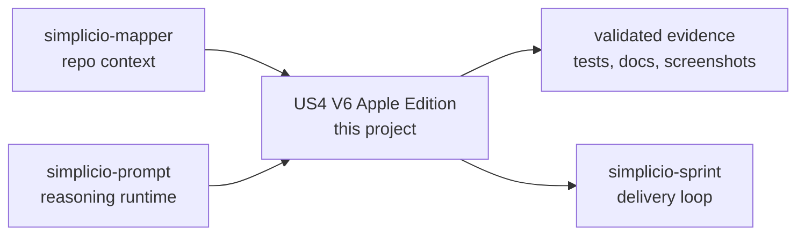

<h1 align="center" dir="rtl">US4 V6 Apple Edition</h1>

<p align="center" dir="rtl">
  <strong>Universal State Runtime لاستدلال LLM المحلي على Apple Silicon: MLX وMetal وNEON ومسار ANE وCLI عملي.</strong><br />
  <em>تبقى الأوامر بالإنجليزية حتى يمكن نسخها بدقة.</em>
</p>

<p align="center">
<a href="https://github.com/wesleysimplicio/ds4-simplicio-apple-v6/stargazers"></a>


</p>

<p align="center">
<a href="../README.md">English</a> | <a href="README.pt-BR.md">Português</a> | <a href="README.es-ES.md">Español</a> | <a href="README.ja-JP.md">日本語</a> | <a href="README.ko-KR.md">한국어</a> | <a href="README.zh-CN.md">简体中文</a> | <a href="README.it-IT.md">Italiano</a> | <a href="README.fr-FR.md">Français</a> | <a href="README.ru-RU.md">Русский</a> | <a href="README.pl-PL.md">Polski</a> | <a href="README.hi-IN.md">हिन्दी</a> | <a href="README.ar-SA.md">العربية</a> | <a href="README.he-IL.md">עברית</a> | <a href="README.ms-MY.md">Bahasa Melayu</a> | <a href="README.id-ID.md">Bahasa Indonesia</a>
</p>

<p align="center">
  
</p>

---

## الخلاصة

Universal State Runtime لاستدلال LLM المحلي على Apple Silicon: MLX وMetal وNEON ومسار ANE وCLI عملي.

## DNA المشروع

تحافظ هذه الصفحة المترجمة على المسار السريع. الدليل التقني الكامل المستعاد موجود في README الرئيسي للحفاظ على صوت المشروع وتفاصيله التشغيلية.

- Full restored guide: [../README.md](../README.md)
- Local project note: us4-v6-simplicio-apple is the desktop packaging edge of the ecosystem: native launchers, bootstrap scripts, CMake/package metadata, and the Apple-facing path for a local Simplicio experience. The refreshed README now keeps the global polish while preserving the practical installation and build notes from the earlier guide.

## البدء السريع

```bash
brew install cmake ninja node
npm ci
cmake -S . -B build -G Ninja -DCMAKE_BUILD_TYPE=Release
cmake --build build --config Release
./build/apps/us4-cli --probe
```

## ماذا يفعل

- Local-first runtime path for Apple Silicon inference experiments.
- CMake + Ninja build with CLI smoke flows.
- Ollama/custom upstream serve path for practical chat backends.
- Runtime docs for MLX, Metal, scheduler, memory, cache and benchmarks.

## لماذا صُمم هذا README لجذب الانتباه

- وعد واضح في أول شاشة
- روابط اللغات قبل التثبيت
- badges وصورة hero للثقة
- quick start قابل للنسخ
- إثبات قبل التفاصيل الطويلة
- رسم النجوم كدليل اجتماعي

## كيف يعمل



## الإثبات والتحقق

- Changelog tracks CMake project version and starter package version separately.
- Playwright CLI smoke tests are the high-signal E2E path.
- Repo currently resolves on GitHub as wesleysimplicio/ds4-simplicio-apple-v6.

## منظومة Simplicio

- [simplicio-mapper](https://github.com/wesleysimplicio/simplicio-mapper) supplies repo context before interpretation.
- [simplicio-cli](https://github.com/wesleysimplicio/simplicio-dev-cli) executes focused code tasks with verification.
- [simplicio-prompt](https://github.com/wesleysimplicio/simplicio-prompt) provides fan-out and consensus runtime patterns.
- [simplicio-sprint](https://github.com/wesleysimplicio/simplicio-sprint) turns cards into draft PR delivery loops.

## معيار التوثيق

- [runtime/README.md](../runtime/README.md)
- [CHANGELOG.md](../CHANGELOG.md)
- [docs/readme-globalization-standard.md](../docs/readme-globalization-standard.md)

## تاريخ النجوم

<a href="https://www.star-history.com/#wesleysimplicio/ds4-simplicio-apple-v6&Date">
  <picture>
    <source media="(prefers-color-scheme: dark)" srcset="https://api.star-history.com/svg?repos=wesleysimplicio/ds4-simplicio-apple-v6&type=Date&theme=dark" />
    <source media="(prefers-color-scheme: light)" srcset="https://api.star-history.com/svg?repos=wesleysimplicio/ds4-simplicio-apple-v6&type=Date" />
    
  </picture>
</a>

## الرخصة

See the repository license and distribution notes before production use.
